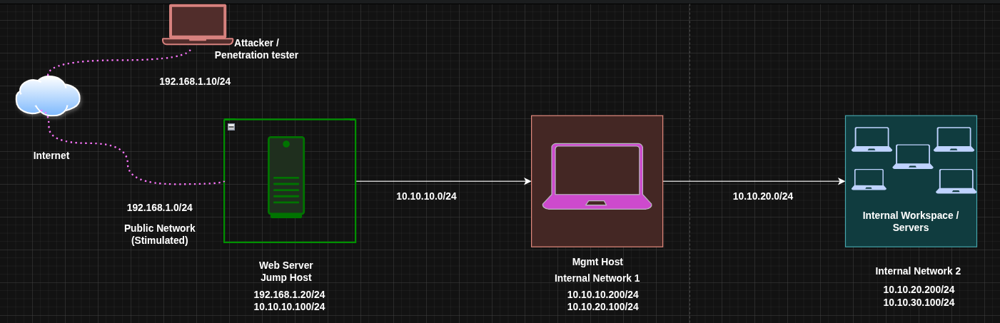
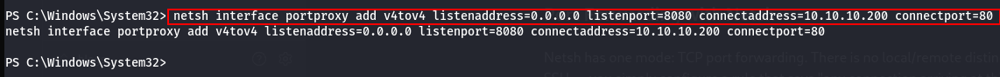
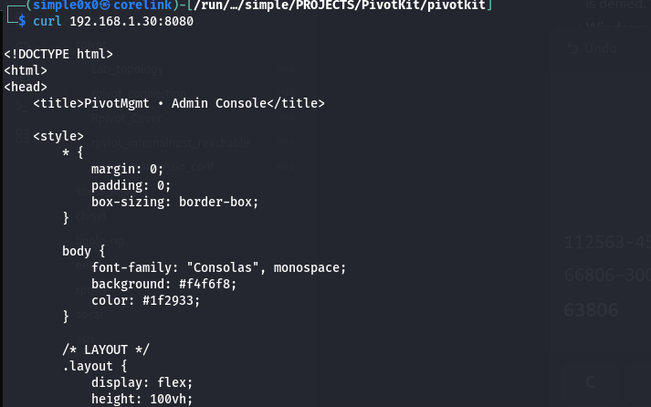
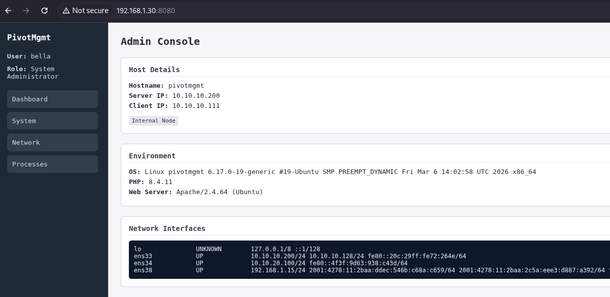

Netsh is a Windows built-in command-line utility for managing network settings. Its `interface portproxy` subcommand sets up TCP port-forwarding rules - redirecting traffic arriving on one address and port to another destination. No binary upload required. No external tools. It ships with every Windows installation from XP onward, making it the quintessential **living-off-the-land (LotL)** pivot technique on Windows.

When you have a foothold on a Windows host that bridges two networks, netsh turns that machine into a TCP relay with a single command.

### Why Netsh?

| Feature          | Netsh         | Socat (Linux)  | Chisel          |
| ---------------- | ------------- | -------------- | --------------- |
| Needs binary     | No (built-in) | Often built-in | Yes             |
| OS               | Windows only  | Linux          | Both            |
| Encryption       | No            | No             | Yes (TLS)       |
| SOCKS proxy      | No            | No             | Yes             |
| Protocol         | TCP only      | TCP + UDP      | TCP + UDP       |
| Persistence      | Reboot-safe   | No             | No              |

The single biggest advantage: **zero footprint**. No new file on disk, no suspicious network download, no unsigned binary for EDR to flag. If you have Administrator, you have a pivot.

### TL;DR

```python
rem Add the port proxy rule
netsh interface portproxy add v4tov4 listenaddress=0.0.0.0 listenport=8080 connectaddress=10.10.10.200 connectport=80

rem Verify the rule is active
netsh interface portproxy show all

rem Allow inbound connections through Windows Firewall
netsh advfirewall firewall add rule name="Pivot-8080" protocol=TCP dir=in localport=8080 action=allow

rem Cleanup when done
netsh interface portproxy delete v4tov4 listenaddress=0.0.0.0 listenport=8080
netsh advfirewall firewall delete rule name="Pivot-8080"
```

### Requirements

- **Administrator privileges** - mandatory. Running portproxy as a standard user returns "Access is denied."  
- **Windows Firewall** - active by default; you must add an allow rule for the listener port.

> [!NOTE]
> Portproxy rules persist across reboots - they are stored in the registry under `HKLM\SYSTEM\CurrentControlSet\Services\PortProxy`. If you forget to clean up, the rule stays active after a reboot and continues exposing internal services.

### Lab Topology

| Host              | Primary IP   | Secondary IP | Open Ports    | Role          |
| ----------------- | ------------ | ------------ | ------------- | ------------- |
| Attacker (Kali)   | 192.168.1.10 | N/A          | N/A           | Attack Box    |
| Window Web DMZ    | 192.168.1.30 | 10.10.10.111 | 80 (outbound) | Jump Host     |
| Admin Mgmt        | 10.10.10.200 | 10.10.20.100 | 80            | Internal Host |
| Internal File srv | 10.10.20.200 | 10.10.30.100 | 80, 445       | Internal Host |

The attacker cannot reach `10.10.10.200` directly. Web DMZ is a Windows host with Administrator access, sitting between both networks. We'll configure it to relay traffic for us.



---

### Port Forwarding with Netsh

Netsh has one mode: TCP port forwarding. There is no local/remote distinction like in Chisel or SSH - you simply configure a rule that says "any connection arriving at this host on this port gets forwarded to that host on that port." It is always the proxy host itself that listens and forwards.

#### Step 1: Add the Port Proxy Rule

On Web DMZ (the Windows pivot), open an Administrator command prompt and run:

```python
netsh interface portproxy add v4tov4 listenaddress=0.0.0.0 listenport=8080 connectaddress=10.10.10.200 connectport=80
```

Argument breakdown:

| Argument            | Meaning                                                       |
| ------------------- | ------------------------------------------------------------- |
| `v4tov4`            | IPv4 → IPv4 forwarding (also: `v4tov6`, `v6tov4`, `v6tov6`) |
| `listenaddress=0.0.0.0` | Listen on all interfaces of the proxy host                |
| `listenport=8080`   | Port that accepts inbound connections on Web DMZ              |
| `connectaddress`    | Internal destination IP (Admin Mgmt)                          |
| `connectport`       | Port on the destination to connect to                         |

When a connection arrives at `192.168.1.20:8080`, Windows silently forwards it to `10.10.10.200:80`. The destination sees the connection coming from Web DMZ's internal IP (`10.10.10.100`), not from the attacker.

On this lab, the current user has Administrator privileges which was gained when using `RunasCS.exe` 

| <br> |  |
| -------------------------------------------------------- | ----------------------------------------------------- |



#### Step 2: Verify the Rule

```python
netsh interface portproxy show all
```

Expected output:

```
Listen on ipv4:             Connect to ipv4:

Address         Port        Address         Port
--------------- ----------  --------------- ----------
0.0.0.0         8080        10.10.10.200    80
```

If the rule doesn't appear, you ran the command without Administrator privileges.

#### Step 3: Open the Firewall

Windows Firewall blocks inbound connections by default. Add an allow rule for the listener port:

```python
netsh advfirewall firewall add rule name="Pivot-8080" protocol=TCP dir=in localport=8080 action=allow
```

Verify it was created:

```python
netsh advfirewall firewall show rule name="Pivot-8080"
```

> [!NOTE]
> On domain-joined machines, Group Policy may override local firewall rules or remove your entry after a GPO refresh. Check whether your rule survives a `gpupdate /force`.
#### Step 4: Access the Internal Service from the Attacker

```bash
# HTTP service on Admin Mgmt
curl http://192.168.1.20:8080

# RDP to Admin Mgmt through the proxy
netsh interface portproxy add v4tov4 listenaddress=0.0.0.0 listenport=3390 connectaddress=10.10.10.200 connectport=3389
# then from attacker:
rdesktop 192.168.1.20:3390
```

The attacker connects to Web DMZ on the proxied port, and the traffic arrives at the internal host seamlessly.

|  |  |
| ------------------------------------------------------------------------------------------------------------------------------ | ------------------------------------------------------------------------------------------------------------------------------- |

#### Step 5: Cleanup

Remove the portproxy rule and firewall entry when done:

```python
rem Remove portproxy rule
netsh interface portproxy delete v4tov4 listenaddress=0.0.0.0 listenport=8080

rem Remove firewall rule
netsh advfirewall firewall delete rule name="Pivot-8080"

rem Confirm clean state
netsh interface portproxy show all
```

The output should be empty or show no remaining entries for the ports you removed.

---

### Double Pivoting (Reaching a Third Network)

You've reached Admin Mgmt (`10.10.10.200`) through Web DMZ. Now you need to go one level deeper - to Internal File Server at `10.10.20.200`, a network only Admin Mgmt can reach.

The strategy: add a second portproxy rule on Web DMZ that forwards a new port to Admin Mgmt's internal interface, and then configure Admin Mgmt to forward that traffic to the final target.

> The key limitation: you need Administrator access on **each** Windows host in the chain.
#### Step 1: Configure Admin Mgmt as a Second Relay

On Admin Mgmt (`10.10.10.200`), add a portproxy rule to forward traffic to the Internal File Server:

```python
netsh interface portproxy add v4tov4 listenaddress=0.0.0.0 listenport=9090 connectaddress=10.10.20.200 connectport=80

netsh advfirewall firewall add rule name="Pivot2-9090" protocol=TCP dir=in localport=9090 action=allow
```

Admin Mgmt now listens on port 9090 and relays to `10.10.20.200:80`.

#### Step 2: Chain Through Web DMZ

On Web DMZ, add a second portproxy rule to forward a new port to Admin Mgmt's new listener:

```python
netsh interface portproxy add v4tov4 listenaddress=0.0.0.0 listenport=9090 connectaddress=10.10.10.200 connectport=9090

netsh advfirewall firewall add rule name="Pivot-9090" protocol=TCP dir=in localport=9090 action=allow
```

#### Step 3: Access the Third Layer from the Attacker

```bash
curl http://192.168.1.20:9090
```

Traffic flows: Attacker → Web DMZ:9090 → Admin Mgmt:9090 → Internal File Server:80.

> [!NOTE]
> Each hop is a separate portproxy rule on a separate host. This scales linearly but requires Administrator on every jump box. For complex chains, Ligolo-ng or Chisel are better choices.

---

### Operational Security Notes

- Portproxy rules are visible via `netsh interface portproxy show all` and in `netstat -ano` as a new listening TCP socket. A new listening port on an unusual number may trigger alerting on monitored hosts. Consider using ports that blend with expected traffic (e.g., 443, 8443).
- Rule creation modifies the registry - forensic analysis will find evidence even after cleanup because registry hives are backed up in Volume Shadow Copies.
- Netsh portproxy is **TCP only**. For UDP forwarding (DNS, SNMP), use socat on a Linux relay.

### Troubleshooting

**"Access is denied":** Run the command in an elevated prompt. Right-click → "Run as Administrator" or use `runas /user:HOSTNAME\Administrator cmd`.

**Rule exists but connection refused:** The firewall allow rule is missing or overridden by GPO. Check with `netsh advfirewall show currentprofile state`.

**Rule and firewall are correct but connection still fails:** Verify the destination service is actually running. Test from Web DMZ directly: `telnet 10.10.10.200 80` or `Test-NetConnection -ComputerName 10.10.10.200 -Port 80` in PowerShell.

**Multiple rules causing confusion:** `netsh interface portproxy show all` lists every rule. Delete by specifying the exact `listenaddress` and `listenport` combination.

### Quick Reference

| Action          | Command                                                                                               |
| --------------- | ----------------------------------------------------------------------------------------------------- |
| Add rule        | `netsh interface portproxy add v4tov4 listenaddress=LADDR listenport=LPORT connectaddress=CADDR connectport=CPORT` |
| Show rules      | `netsh interface portproxy show all`                                                                  |
| Allow firewall  | `netsh advfirewall firewall add rule name="NAME" protocol=TCP dir=in localport=PORT action=allow`     |
| Delete rule     | `netsh interface portproxy delete v4tov4 listenaddress=LADDR listenport=LPORT`                        |
| Delete firewall | `netsh advfirewall firewall delete rule name="NAME"`                                                  |

### When to Use Netsh vs Alternatives

Use **netsh** when: the pivot is Windows, you have Administrator access, and you want zero new files on disk. It is the ideal LotL technique on Windows segment bridges.

Use **socat** when: the pivot is Linux and you want the same simplicity with a tool that is often already installed.

Use **Chisel** when: you need encryption, a SOCKS5 proxy, or outbound HTTP is the only permitted protocol.

Use **Ligolo-ng** when: you need full native routing across multiple hops without per-service port forward configuration.
